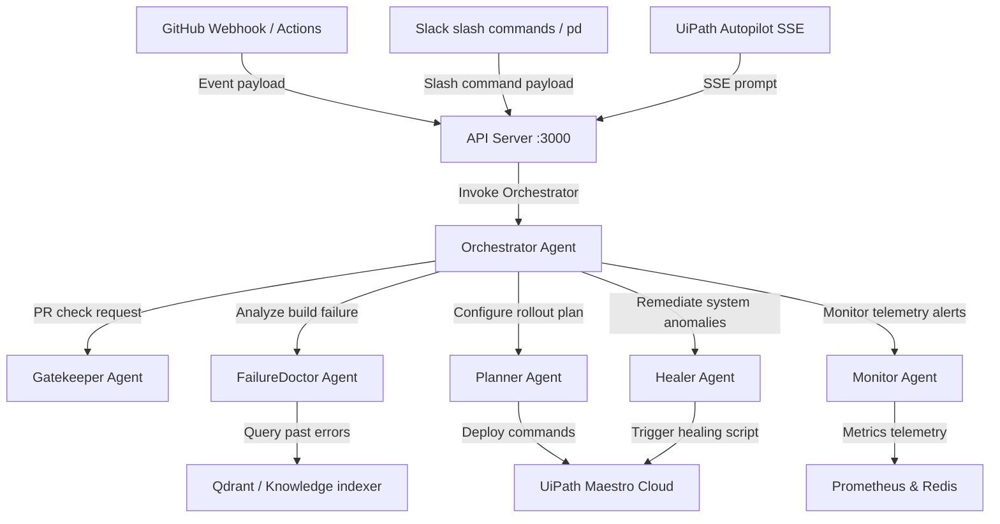

# PipelineDoc 🚀

An AI-powered agent layer that sits between your source code and production, acting as a **doctor, gatekeeper, planner, and auto-healer** for the entire software delivery pipeline.

---

## 🗺️ Multi-Agent Architecture



---

## ⚡ Quick Start (&lt; 5 Minutes)

Deploy the platform in minutes:

### 1. Copy Environment Keys
```bash
cp .env.example .env
cp .env.example api/.env
```
Update `.env` with your API credentials (e.g. `ANTHROPIC_API_KEY`, `JWT_SECRET`).

### 2. Startup Databases via Docker
Spin up PostgreSQL and Redis instances instantly:
```bash
docker-compose up -d
```

### 3. Initialize Schema
Run database migrations:
```bash
psql -h localhost -U admin -d pipelinedoc -f scripts/db-init.sql
```

### 4. Run the Test Suites
Validate installation by running native Node test runners:
```bash
npm install
node --test tests/**/*.test.js
```

### 5. Launch Backend & Dashboard
Start the API backend:
```bash
cd api
npm install
npm run dev
```

In a new terminal window, start the Vite development server:
```bash
cd frontend
npm install --legacy-peer-deps
npm run dev
```
Open `http://localhost:5173` to interact with the PipelineDoc dashboard.

---

## 📖 Documentation Index

For detailed guidelines and setup parameters, consult our documentation:

- 🚀 [Installation and Setup Guide](docs/SETUP.md): Prerequisite installation, DB structure, and system startup.
- 🧠 [Agent Architectures and Modules](docs/AGENTS.md): How Gatekeeper, Planner, FailureDoctor, Healer, and Monitor work together.
- 🔌 [Integrations Guide](docs/INTEGRATIONS.md): Connecting webhooks for GitHub, UiPath Maestro Cloud, and Slack bots.
- 🌐 [API Reference Guide](docs/API.md): Comprehensive descriptions of all REST and SSE endpoints with payload payloads.
