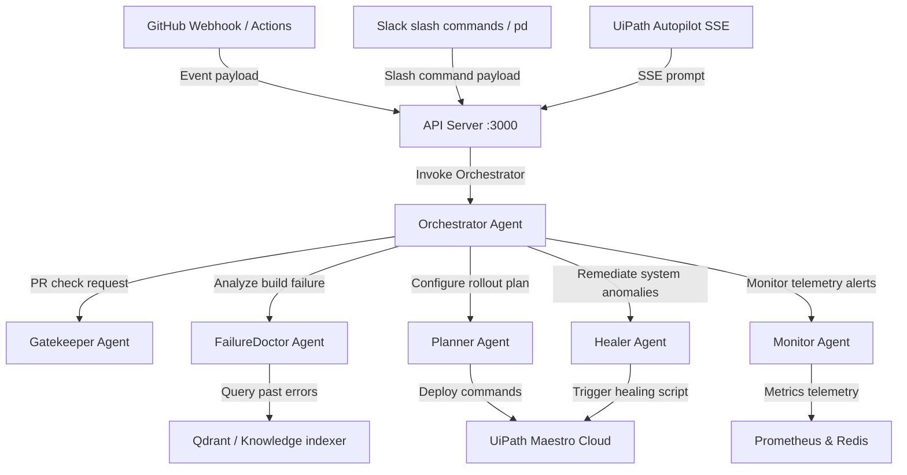

# PipelineDoc 🚀

An AI-powered agent layer that sits between your source code and production, acting as a **doctor, gatekeeper, planner, and auto-healer** for the entire software delivery pipeline.

---

## 🗺️ Multi-Agent Architecture



---

## ⚡ Quick Start (< 5 Minutes)

Deploy the platform in minutes:

### 1. Copy Environment Keys
```bash
cp .env.example .env
cp .env.example backend/.env
```
Update `.env` with your API credentials (e.g. `ANTHROPIC_API_KEY`, `JWT_SECRET`).

### 2. Startup Databases via Docker
Spin up PostgreSQL and Redis instances instantly:
```bash
docker-compose up -d
```

### 3. Initialize Schema
Run database migrations:
```bash
npm run db:init
```

### 4. Bootstrap Dependencies
Installs packages for root workspace, Express API, and React dashboard concurrently:
```bash
npm run bootstrap
```

### 5. Start Application (Backend + Dashboard Concurrently)
Start both development servers in a single terminal:
```bash
npm run dev
```
- API backend will start and listen on [http://localhost:3000](http://localhost:3000).
- React dashboard client will spin up on [http://localhost:5173](http://localhost:5173).

Open [http://localhost:5173](http://localhost:5173) in your browser to view the **UiPath Orchestrator Hub & Self-Healing Pipeline Dashboard**!

### 6. Run the Test Suites
Verify all agent modules are active and working:
```bash
npm run test
```

---

## 📖 Documentation Index

For detailed guidelines and custom development, consult our documentation:

- 🚀 [Installation and Setup Guide](docs/SETUP.md): Detailed prerequisite installation, DB schema tables, and system startup.
- 🧠 [Agent Architectures and Modules](docs/AGENTS.md): How Gatekeeper, Planner, FailureDoctor, Healer, and Monitor work together.
- 🔧 [Developer & Extensibility Guide](docs/ARCHITECTURE_AND_EXTENDING.md): Architecture diagrams, runtime data flows, and code examples for adding custom agents, integrations, or alternative LLM backends (Ollama/Azure OpenAI).
- 🔌 [CI/CD Project Integration Guide](docs/INTEGRATION_GUIDE.md): Connecting any code repository (GitHub Actions, GitLab CI, or custom bash script) to PipelineDoc via API.
- 🔌 [Internal Webhooks Guide](docs/INTEGRATIONS.md): Setup details for internal GitHub Webhook, Slack bot tokens, and UiPath Cloud keys.
- 🌐 [API Reference Guide](docs/API.md): Comprehensive descriptions of all REST and SSE endpoints with payload formats.
