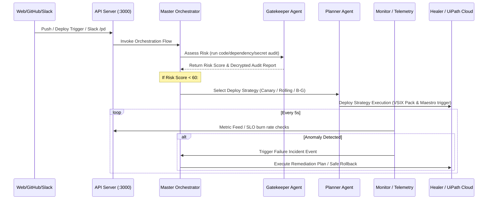

# PipelineDoc Developer, Architecture & Extension Guide

This guide is designed for developers who want to modify, customize, or extend **PipelineDoc** for different enterprise use cases. It covers directory structures, runtime data flows, adding new agents, adding integrations, and adapting the platform to alternative technologies (e.g., custom cloud, circular testing, or different LLM engines).

---

## 🗺️ Project Directory Structure

PipelineDoc is structured as a modular monorepo. Here is a high-level catalog of the folders and files:

```
pipelinedoc/
├── package.json               # Root monorepo workspace configuration & runner scripts
├── docker-compose.yml          # Container configuration for PostgreSQL and Redis databases
├── .env.example                # Sample template for environment variables
│
├── backend/            # Express API server, agents, config, integrations
  │   ├── src/
  │     │     │   └── backend/integrations/                       # --- Backend API Gateway ---
│   ├── package.json           # Backend dependency configuration
│   └── src/
│       ├── index.js           # API entry point (registers middlewares & routes)
│       ├── middleware/        # JWT Authentication, rate limiting, and request validation
│       ├── routes/            # REST and SSE Stream endpoints (chat, deployments, incidents)
│       └── services/          # Direct DB & Redis interactions
│
├── frontend/                  # --- React Dashboard Client ---
│   ├── package.json           # Frontend dependencies (React 19, Vite, Recharts, Tailwind v4)
│   ├── index.html             # Document wrapper
│   └── src/
│       ├── main.tsx           # Dashboard mount point
│       ├── App.tsx            # Main router
│       ├── index.css          # CSS Variables (Locked to professional light theme)
│       ├── components/        # Shell containers (e.g. Layout.tsx sidebar, header)
│       ├── pages/             # UI views (Overview, Chat assistant, Intelligence, UiPathHub)
│       └── services/          # API fetch wrapper
│
├── backend/agents/                    # --- Autonomous AI Agent Logic (Reusable Node modules) ---
│   ├── orchestrator/          # Master coordinator (routes actions between agents)
│   ├── analysis/              # Failure Doctor log/diff analyzer and RCA logic
│   ├── gatekeeper/            # Pre-deployment risk analyzer and security scanner
│   ├── planner/               # Deployment strategy, windows, and rollback planner
│   ├── monitor/               # Watcher for telemetry anomalies & SLO tracking
│   ├── healer/                # Remediations executor and automated rollbacks trigger
│   └── memory/                # Postmortem generator and knowledge base retriever
│
├── backend/integrations/              # --- Connector Clients to External Systems ---
│   ├── github/                # PR info retrieval, comments poster, and diff extractor
│   ├── uipath/                # Unattended robot execution client & Queue Transaction pusher
│   ├── slack/                 # Channel notifier and commands listener
│   └── cloud/                 # Cloud provider interface (OCI wrapper)
│
├── infra/                     # Infrastructure-as-code files (Terraform module templates)
├── scripts/                   # Telemetry generator and testing mock scripts
└── tests/                     # Jest-style test suites matching the agent architecture
```

---

## 🔄 Runtime Core Data Flow

When a developer triggers a pipeline, the system flows sequentially through these nodes:



---

## 🛠️ Step-by-Step Customization Guides

### 1. How to Add a New AI Agent

If you want to add a new specialist agent (e.g., a **Security Auditor Agent** that performs SAST analysis before deployment):

1. **Create the module file**: Under `backend/agents/gatekeeper/` or `backend/agents/security/` (e.g., `backend/agents/gatekeeper/sast-scanner.js`).
   ```javascript
   // backend/agents/gatekeeper/sast-scanner.js
   const aiClient = require('../../backend/config/ai-client');

   async function scanCodeForVulnerabilities(codeDiff) {
     const prompt = `Analyze this code change for security bugs. Return a JSON output containing "severity" (low, medium, high) and "issues" list:\n\n${codeDiff}`;
     
     const response = await aiClient.generateContent({
       system: "You are a professional AppSec agent.",
       prompt: prompt,
       temperature: 0.1
     });

     return JSON.parse(response.text);
   }

   module.exports = { scanCodeForVulnerabilities };
   ```

2. **Integrate into the Gatekeeper decision layer**: Open `backend/agents/gatekeeper/gate-decision.js` and import your scanner to incorporate its findings into the risk score formula.
3. **Register in the Chat Router (for conversational triggers)**: Open `backend/src/routes/chat.js` and add a tool description to the `toolsList` so the Autopilot LLM can run the security scan on-demand.
4. **Write Tests**: Create `tests/gatekeeper/sast-scanner.test.js` mimicking standard mocks.
   ```javascript
   const test = require('node:test');
   const assert = require('node:assert');
   const sastScanner = require('../../backend/agents/gatekeeper/sast-scanner');
   
   test('SAST Scanner returns mock issues list', async () => {
     // Run scanner and assert values...
   });
   ```

---

### 2. How to Add a New Integration Client

To connect to a custom platform (e.g., deploying to **Kubernetes via ArgoCD** instead of UiPath):

1. **Create a client module**: Under `backend/integrations/argocd/client.js`.
   ```javascript
   const axios = require('axios');
   require('dotenv').config();

   const ARGO_URL = process.env.ARGOCD_URL || 'http://argocd.local';

   async function syncApplication(appName) {
     if (process.env.NODE_ENV !== 'production') {
       return { status: 'Synced', message: `Mock synced ${appName}` };
     }
     
     const response = await axios.post(`${ARGO_URL}/api/v1/applications/${appName}/sync`, {}, {
       headers: { 'Authorization': `Bearer ${process.env.ARGOCD_TOKEN}` }
     });
     return response.data;
   }

   module.exports = { syncApplication };
   ```
2. **Add credential vars to environment**: Add `ARGOCD_URL` and `ARGOCD_TOKEN` keys to `.env.example` and load them in configuration files.
3. **Link into deployment coordinator**: Open `backend/agents/planner/deploy-coordinator.js` and import the client, substituting or complementing the `triggerUiPathJob` commands.

---

### 3. Swapping the LLM Provider (Alternative Models)

PipelineDoc uses a unified client model inside `backend/config/ai-client.js` that abstracts both Google Gemini (standard) and Anthropic Claude APIs. 

To use alternative model endpoints (such as a local **Ollama** or **Azure OpenAI**):

1. Install the appropriate SDK, e.g. `@azure/openai`.
2. Open `backend/config/ai-client.js`.
3. Add a check inside `getProvider()` to return your custom client and rewrite the wrapper call:
   ```javascript
   // Example mapping Azure OpenAI inside generateContent:
   const { OpenAIClient, AzureKeyCredential } = require("@azure/openai");
   
   async function generateContent({ system, prompt }) {
     const provider = getProvider();
     if (provider === 'azure') {
       const client = new OpenAIClient(process.env.AZURE_OPENAI_ENDPOINT, new AzureKeyCredential(process.env.AZURE_OPENAI_KEY));
       const deploymentName = process.env.AZURE_OPENAI_DEPLOYMENT;
       const response = await client.getChatCompletions(deploymentName, [
         { role: "system", content: system },
         { role: "user", content: prompt }
       ]);
       return { text: response.choices[0].message.content, provider: 'azure' };
     }
     // fallback to gemini / anthropic...
   }
   ```

---

## 🧪 Testing and CI Standards

To protect against breaking code changes, maintain the following practices:
- **Always mock network calls in tests**: Load `process.env.NODE_ENV = 'test'` in tests to disable live API connections and use JSON fixtures.
- **Run the full suite regularly**: Prior to code deployment, always check changes by executing:
  ```bash
  npm run test
  ```
  This automatically runs `LLM_PROVIDER=anthropic node --test` to prevent external API collision errors.
